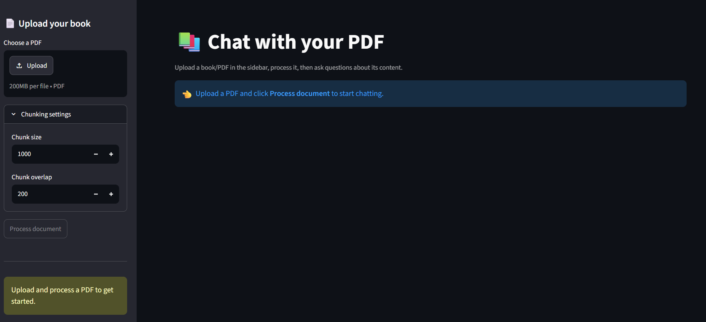

# 📚 Chat with your PDF — RAG-powered Document Q&A

A Retrieval-Augmented Generation (RAG) application that lets you upload a PDF and ask natural-language questions about its content. Built with LangChain, ChromaDB, HuggingFace embeddings, and Mistral AI, with an interactive Streamlit interface.



## ✨ Features

- **📤 Upload any PDF** directly through the browser — no manual file placement needed
- **✂️ Configurable chunking** — adjust chunk size and overlap from the UI
- **🔍 Semantic search** using MMR (Maximal Marginal Relevance) retrieval for diverse, relevant context
- **💬 Conversational chat interface** with persistent session history
- **📎 Source transparency** — every answer shows the exact chunks/pages it was drawn from
- **🚫 Grounded answers only** — the model is instructed to say "I could not find the answer in the document" instead of hallucinating
- **🔄 Swap documents on the fly** — clear and re-index a new PDF anytime

## 🏗️ How it works

```
PDF Upload
    │
    ▼
PyPDFLoader (load pages)
    │
    ▼
RecursiveCharacterTextSplitter (chunk into overlapping segments)
    │
    ▼
HuggingFace Embeddings (sentence-transformers/all-MiniLM-L6-v2)
    │
    ▼
ChromaDB (persisted vector store)
    │
    ▼
User Question ──► MMR Retriever ──► Top-k relevant chunks
    │
    ▼
Prompt Template (context + question)
    │
    ▼
ChatMistralAI (mistral-small-2506) ──► Answer + cited sources
```

## 🛠️ Tech Stack

| Layer              | Technology                                      |
|---------------------|--------------------------------------------------|
| UI                  | [Streamlit](https://streamlit.io/)               |
| Orchestration        | [LangChain](https://www.langchain.com/)          |
| Vector Store         | [ChromaDB](https://www.trychroma.com/)           |
| Embeddings           | HuggingFace `sentence-transformers/all-MiniLM-L6-v2` |
| LLM                  | [Mistral AI](https://mistral.ai/) (`mistral-small-2506`) |
| PDF Parsing          | `pypdf`                                          |

## 📁 Project Structure

```
.
├── app.py               # Streamlit UI — upload, ingest, and chat
├── requirements.txt      # Python dependencies
├── .env                  # API keys (not committed)
└── chroma_db/             # Persisted vector store (auto-generated, not committed)
```

## 🚀 Getting Started

### Prerequisites

- Python 3.9+
- A [Mistral AI API key](https://console.mistral.ai/)

### Installation

1. **Clone the repository**
   ```bash
    git clone https://github.com/khaitanpatil-bot/RAG_PROJECT.git
    cd RAG_PROJECT
   ```

2. **Create a virtual environment** (recommended)
   ```bash
   python -m venv venv
   source venv/bin/activate      # On Windows: venv\Scripts\activate
   ```

3. **Install dependencies**
   ```bash
   pip install -r requirements.txt
   ```

4. **Set up environment variables**

   Create a `.env` file in the project root:
   ```env
   MISTRAL_API_KEY=your_mistral_api_key_here
   ```

### Running the app

```bash
streamlit run app.py
```

The app will open automatically at `http://localhost:8501`.

## 📖 Usage

1. Open the app in your browser.
2. In the sidebar, upload a PDF using **Upload your book**.
3. (Optional) Adjust chunk size/overlap under **Chunking settings**.
4. Click **Process document** to index the PDF into the vector store.
5. Once processing completes, ask questions in the chat box.
6. Expand **Sources used** under any answer to see which chunks/pages informed it.
7. Use **Clear document & chat** to reset and load a different PDF.

## ⚙️ Configuration

| Parameter       | Default | Description                                  |
|------------------|---------|-----------------------------------------------|
| `chunk_size`      | 1000    | Max characters per text chunk                 |
| `chunk_overlap`   | 200     | Overlapping characters between chunks         |
| `k`               | 4       | Number of chunks retrieved per query          |
| `fetch_k`         | 10      | Candidate pool size for MMR                   |
| `lambda_mult`     | 0.5     | Diversity vs. relevance trade-off (0–1)       |

These retrieval parameters are set in `app.py` and can be tuned directly in code.

## ⚠️ Known Limitations

- The vector store (`chroma_db/`) is shared across sessions on a single deployment — not designed for concurrent multi-user use without modification (see Roadmap).
- Large PDFs may take longer to process depending on hardware, since embeddings are computed locally via `sentence-transformers`.
- Answers are strictly grounded in the uploaded document; general knowledge questions outside the PDF will not be answered.

## 🗺️ Roadmap

- [ ] Per-session vector stores for multi-user deployments
- [ ] Support for multiple file formats (DOCX, TXT, EPUB)
- [ ] Multi-document upload and cross-document search
- [ ] Chat history export
- [ ] Dockerized deployment

## 🤝 Contributing

Contributions are welcome! Please open an issue first to discuss what you'd like to change.

1. Fork the repository
2. Create your feature branch (`git checkout -b feature/amazing-feature`)
3. Commit your changes (`git commit -m 'Add some amazing feature'`)
4. Push to the branch (`git push origin feature/amazing-feature`)
5. Open a Pull Request

## 📄 License

This project is licensed under the MIT License — see the [LICENSE](LICENSE) file for details.

## 🙏 Acknowledgements

- [LangChain](https://www.langchain.com/) for the RAG orchestration framework
- [Mistral AI](https://mistral.ai/) for the language model
- [Streamlit](https://streamlit.io/) for the rapid UI framework
